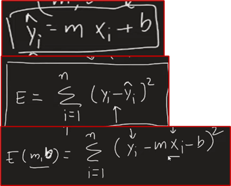
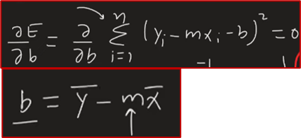

# LinearRegression
Linear Regression Modelling

**1.Simple Linear Regression (direct)**

y = mxi + b

Minimizing loss function with derivative and calculating 0

**1.1 Measures of variation**

* Total Sum of squares SST = (y-y_bar)^2
* Error Sum of squares SSE = (y-y_hat)^2
* Regression Sum of squares SSR = (y_hat-y_bar)^2

**1.2 Coefficient of Determination**

* n= number of data points
* k= number of predictors

* R-Squared = 1 - SSE/SST
* adjusted-r-squared = (1-r-squared)(n-1)/(n-k-1)

**1.3 Standard Error**
* Mean Squared Error MSE = SSE/(n-k-1)
* tandard Error Estimate = s = sqrt(MSE)

**1.4 Assumptions of Linear Regression**

* Linearity
* Independence of errors
* Normality of error
* Equal variance

**Metrics**

**2. Multivariate Linear Regression (direct)**

coefficient matrix

matrix multiplication time complexity is O(n3)